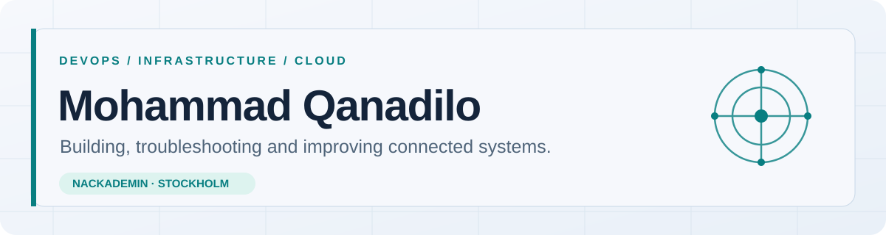

<picture>
  <source media="(prefers-color-scheme: dark)" srcset="assets/profile-dark.svg">
  <source media="(prefers-color-scheme: light)" srcset="assets/profile-light.svg">
  
</picture>

 

**[About](#about-me) · [What I work with](#what-i-work-with) · [Projects](#selected-work) · [Courses](#my-devops-education)**

---

## About me

Hi, I'm **Mohammad**. I study **DevOps Engineer at Nackademin** in Stockholm. I like understanding how the pieces of a system fit together: the code, the data, the operating system, the network and the infrastructure that keeps everything running.

In my labs, I build environments, investigate what breaks and document how I fixed it. I am currently learning **cloud operations with Azure and identity services**, while building a virtual server environment in Hyper-V.

My experience from security, retail, restaurants and logistics has shaped the way I work: stay calm, follow through, notice details and communicate clearly when other people depend on the result.

> **My approach:** understand the system → isolate the problem → test a fix → verify it → document it.

## What I work with

| Layer | Experience from coursework and labs |
| :--- | :--- |
| **Code & data** | Python, Java, SQL, SQLite, MariaDB; application structure, data handling, queries and troubleshooting. |
| **Operating systems** | Linux, Ubuntu, Windows Server; command line, services, accounts, permissions and administration. |
| **Networks & identity** | TCP/IP, IP addressing, virtual networks, DNS, DHCP, Active Directory, domain joins and VPN. |
| **Infrastructure & security** | Hyper-V, server roles, Apache/HTTPS, WireGuard, UFW, Fail2ban, access control and security analysis. |
| **Cloud · in progress** | Microsoft Azure, Entra ID, cloud networking and identity in my current course. |
| **Ways of working** | Git and GitHub, PowerShell, agile methods, technical documentation and systematic troubleshooting. |

## Selected work

These are **education and lab projects**. I am preparing repository documentation so that the implementation, tests and lessons learned can be inspected here.

<table>
  <tr>
    <td width="50%" valign="top">
      <h3>01 · Secure Virtual Data Center</h3>
      
<strong>Group project · completed</strong>

      
A small virtual company environment with Windows Server for AD, DNS, DHCP and certificate services, plus Ubuntu/Apache over HTTPS. The design included segmented internal networks, WireGuard, firewall rules and Fail2ban. I presented the architecture and security decisions.

    </td>
    <td width="50%" valign="top">
      <h3>02 · Virtualized Enterprise Infrastructure</h3>
      
<strong>Hyper-V / cloud operations lab · in progress</strong>

      
A multi-VM environment with a domain controller, file server and SQL server. I am working through virtual switches, IP configuration, domain membership, access rights and troubleshooting. Azure and cloud identity work is part of the ongoing course.

    </td>
  </tr>
  <tr>
    <td width="50%" valign="top">
      <h3>03 · Event Database &amp; Recovery Lab</h3>
      
<strong>MariaDB / SQL · completed coursework</strong>

      
An event-management database with attendees, event types and registrations. The work included SQL queries, a stored procedure for attendee counts, and backup and restore.

    </td>
    <td width="50%" valign="top">
      <h3>04 · Python Movie Database</h3>
      
<strong>Python / SQLite · completed group coursework</strong>

      
A menu-driven film application that uses external JSON data and SQLite for search and favorites. It brought together application structure, data persistence and error handling.

    </td>
  </tr>
</table>

## My DevOps education

**Nackademin · DevOps Engineer (YH)** — course status as of **September 2026**. The full course list and descriptions are on [Nackademin's program page](https://nackademin.se/utbildningar/devops-engineer/).

### Completed coursework

| Foundation | Systems & infrastructure |
| :--- | :--- |
| Programmering 1 | Windows Server |
| Programmering 2 | Linux 1 |
| Programmering 3 | LAN |
| Databashantering | IT-säkerhet och sårbarhetsanalys |
| Projektmetodik och agila metoder | Linux 2 |

**How the courses connect:** programming and databases help me understand applications and data; Linux, Windows Server and LAN give me the system and network foundation; security and agile methods inform how I design, collaborate and document.

### In progress

**Molndrift av tjänster och applikationer** · Azure, cloud infrastructure, networking and identity.

### Upcoming in the program

- Automatisering med configuration management program
- Continuous integration och continuous delivery
- Affärsmannaskap
- LIA
- Examensarbete

These are part of my program plan and are **not presented as completed practical experience**.

---

**Interested in infrastructure, cloud operations and the practical side of DevOps.** 
[Repositories](https://github.com/moqa99?tab=repositories) · [Nackademin DevOps Engineer](https://nackademin.se/utbildningar/devops-engineer/)

